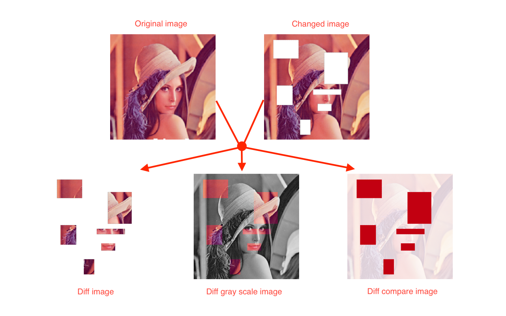

# PixelMatcher

[](https://badge.fury.io/rb/pixel_matcher)
[](https://travis-ci.org/ksk001100/pixel_matcher)


Library to compare images and generate difference image files



## Installation

Add this line to your application's Gemfile:

```ruby
gem 'pixel_matcher'
```

And then execute:

    $ bundle

Or install it yourself as:

    $ gem install pixel_matcher

## Usage

```ruby
require 'pixel_matcher'

# from rmagick image
require 'rmagick'
diff = PixelMatcher::DiffImage.new(Magick::Image.read('img1.png').first, Magick::Image.read('img2.png').first)
diff.export('diff.png') # or mode: :only
diff.export('gray_scale.png', mode: :gray_scale)
diff.export('compare.png', mode: :compare)

# from file path
diff = PixelMatcher::DiffImage.from_path('img1.png', 'img2.png')
diff.export('diff.png') # or mode: :only
diff.export('gray_scale.png', mode: :gray_scale)
diff.export('compare.png', mode: :compare)

# from blob
diff = PixelMatcher::DiffImage.from_blob(File.read('img1.png'), File.read('img2.png'))
diff.export('diff.png') # or mode: :only
diff.export('gray_scale.png', mode: :gray_scale)
diff.export('compare.png', mode: :compare)
```


## Development

After checking out the repo, run `bin/setup` to install dependencies. Then, run `rake spec` to run the tests. You can also run `bin/console` for an interactive prompt that will allow you to experiment.

To install this gem onto your local machine, run `bundle exec rake install`. To release a new version, update the version number in `version.rb`, and then run `bundle exec rake release`, which will create a git tag for the version, push git commits and tags, and push the `.gem` file to [rubygems.org](https://rubygems.org).

## Contributing

Bug reports and pull requests are welcome on GitHub at https://github.com/ksk001100/pixel_matcher. This project is intended to be a safe, welcoming space for collaboration, and contributors are expected to adhere to the [Contributor Covenant](http://contributor-covenant.org) code of conduct.

## License

The gem is available as open source under the terms of the [MIT License](https://opensource.org/licenses/MIT).

## Code of Conduct

Everyone interacting in the PixelMatcher project’s codebases, issue trackers, chat rooms and mailing lists is expected to follow the [code of conduct](https://github.com/ksk001100/pixel_matcher/blob/master/CODE_OF_CONDUCT.md).
